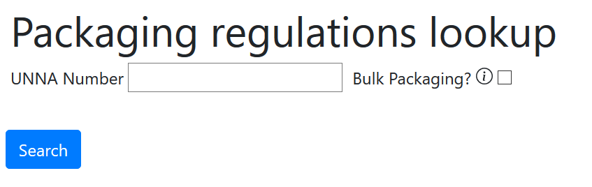
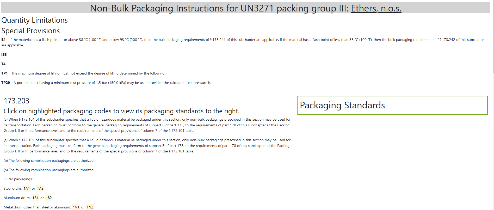
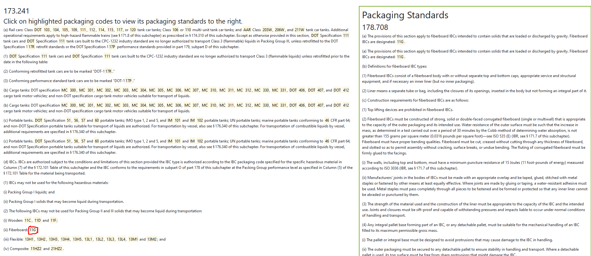

# hazmat-parser

This tool parses Title 49 of the CFR for regulations about shipping hazardous materials, namely the Hazardous Materials Regulations (HMR), located in parts 100-185. The specific links that are parsed are:<br>
https://www.govinfo.gov/content/pkg/CFR-2019-title49-vol2/xml/CFR-2019-title49-vol2.xml<br>
https://www.govinfo.gov/content/pkg/CFR-2019-title49-vol3/xml/CFR-2019-title49-vol3.xml


## Set up

1. Create a conda environment using the provided environment.yml file by running:

```
conda env create -f environment.yml
```
2. Before initializing the database, choose a directory where your database will be saved, and enter the path after the DATABASE_PATH variable within cfr_tool/db.py. For example, the variable is currently set to `DATABASE_PATH = '../hazmat-parser/instance'`. Modify that path to your location of choice. 

2. Run flask in development mode with FLASK_APP=cfr_tool. Afterwards,  run `flask init-db` before `flask run`. The command `flask init-db` initializes the database and will store the file hazmat_parser.sqlite within your chosen directory. Once the database is initialized, `flask init-db` will no longer be necessary. The command `flask run` opens the web app.
<br>
For Linux and Mac:
```
$ export FLASK_APP=cfr_tool
$ export FLASK_ENV=development
$ flask init-db
$ flask run
```

For Windows cmd:
```
> set FLASK_APP=cfr_tool
> set FLASK_ENV=development
> flask init-db
> flask run
```
For Windows PowerShell
```
> $env:FLASK_APP = "cfr_tool"
> $env:FLASK_ENV = "development"
> flask init-db
> flask run
```
Open a browser and type in http://127.0.0.1:5000/.

## Using the Web App

The web app within http://127.0.0.1:5000/ displays an option for searching the packaging regulations by UNNA number and bulk/non bulk. UNNA number should be searched in the format 'UNXXXX'.


Searches of UNNA numbers with packaging instructions that vary by packing group will then be asked to specify the packing group. For example UN3271 has different packaging instructions for packing group II and III.


Search results will display placeholders (currently incomplete) for quantity limitations and special provisions, along with the corresponding packaging instructions in part 173. Throughout the text, UNNA packaging numbers are highlighted.


Highlighted UNNA packaging numbers are clickable and will return corresponding packaging standards in the green box to the right. For example, 11G within 173.241 was parsed successfully and will return packaging standards within 178.708. However, many tank car codes and some specification packaging are not yet successfully parsed to match with its packaging standards. Those codes are highlighted but will not return a packaging standard when clicked.


## Using the Database

To access the database:

1. Open up sqlite by running `sqlite3`.

2. In sqlite, run `.open <db path>`. By default, the database is located in 'instance/hazmat-parser.sqlite'. This should be recorded in the DATABASE_PATH variable within cfr_tool/db.py.

3. Begin querying. A complete ER diagram of the database exists in 'CFR Database ER Diagram.pdf' and data dictionary within 'data_dictionary.pdf'.

Below are a few example queries which would answer common questions about the CFR.

What packaging codes are mentioned in the packaging requirements section for non-bulk packaging of UN1075?
```
SELECT authorizing_agency, packaging_code FROM packaging_requirements 
JOIN packaging_instructions
ON packaging_requirements.section = packaging_instructions.section
JOIN hazmat_table
ON packaging_instructions.row_id = hazmat_table.row_id
WHERE unna_code = 'UN1075' AND packaging_instructions.bulk = 0;
```

According to the packaging requirements, how many hazmat UNNA numbers are associated with nonbulk packaging within a 5H4 plastic film bag?
```
SELECT COUNT(DISTINCT unna_code) 
FROM hazmat_table
JOIN packaging_instructions
ON hazmat_table.row_id = non_bulk_packaging.row_id
JOIN packaging_requirements 
ON packaging_requirements.section = packaging_instructions.section
WHERE packaging_requirements.packaging_code = '5H4' AND packaging_instructions.bulk = 0;
```

According to the packaging requirements, which hazmat are associated with bulk shipping in a DOT 115 cargo tank?
```
SELECT DISTINCT unna_code, hazmat_name
FROM hazmat_table
JOIN packaging_instructions
ON hazmat_table.row_id = bulk_packaging.row_id 
JOIN packaging_requirements 
ON packaging_requirements.section = packaging_instructions.section
WHERE packaging_requirements.authorizing_agency = 'DOT'
AND packaging_requirements.packaging_code = '115'
AND packaging_instructions.bulk = 1;
```

